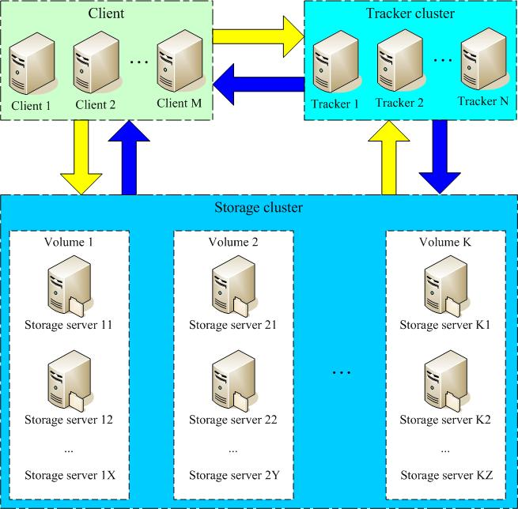
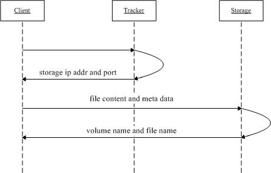
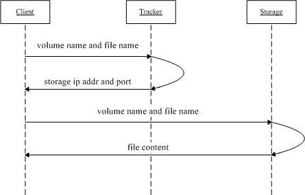

# FastDFS 分布式文件系统

github：https://github.com/happyfish100/fastdfs

FastDFS 是一个开源的分布式文件系统，她对文件进行管理，功能包括：文件存储、文件同步、文件访问（文件上传、文件下载）等，解决了大容量存储和负载均衡的问题。特别适合以文件为载体的在线服务，如相册网站、视频网站等等。

### 软件简介

FastDFS 服务端有两个角色：跟踪器（tracker）和存储节点（storage）。跟踪器主要做调度工作，在访问上起负载均衡的作用。

存储节点存储文件，完成文件管理的所有功能：存储、同步和提供存取接口，FastDFS 同时对文件的 meta data 进行管理。所谓文件的 meta data 就是文件的相关属性，以键值对（key value pair）方式表示，如：width=1024，其中的 key 为 width，value 为 1024。文件 meta data 是文件属性列表，可以包含多个键值对。

FastDFS 系统结构如下图所示：

跟踪器和存储节点都可以由一台多台服务器构成。跟踪器和存储节点中的服务器均可以随时增加或下线而不会影响线上服务。其中跟踪器中的所有服务器都是对等的，可以根据服务器的压力情况随时增加或减少。

为了支持大容量，存储节点（服务器）采用了分卷（或分组）的组织方式。存储系统由一个或多个卷组成，卷与卷之间的文件是相互独立的，所有卷 的文件容量累加就是整个存储系统中的文件容量。一个卷可以由一台或多台存储服务器组成，一个卷下的存储服务器中的文件都是相同的，卷中的多台存储服务器起 到了冗余备份和负载均衡的作用。

在卷中增加服务器时，同步已有的文件由系统自动完成，同步完成后，系统自动将新增服务器切换到线上提供服务。

当存储空间不足或即将耗尽时，可以动态添加卷。只需要增加一台或多台服务器，并将它们配置为一个新的卷，这样就扩大了存储系统的容量。
FastDFS 中的文件标识分为两个部分：卷名和文件名，二者缺一不可。

上传文件交互过程：

1. client 询问 tracker 上传到的 storage，不需要附加参数；
2. tracker 返回一台可用的 storage；
3. client 直接和 storage 通讯完成文件上传。

下载文件交互过程：

1. client 询问 tracker 下载文件的 storage，参数为文件标识（卷名和文件名）；
2. tracker 返回一台可用的 storage；
3. client 直接和 storage 通讯完成文件下载。

需要说明的是，client 为使用 FastDFS 服务的调用方，client 也应该是一台服务器，它对 tracker 和 storage 的调用均为服务器间的调用。