# CentOS7调整磁盘分区

## 对磁盘进行扩容

当磁盘空间不足时，需要对磁盘进行扩容。可以在虚拟机选项中直接增加磁盘大小，比如增加100G到300G。

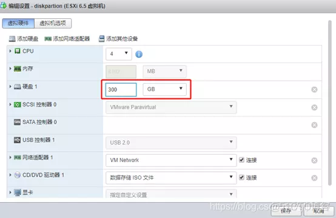

使用`fdisk /dev/sda`命令对新加磁盘空间进行分区，先输入`m`查看帮助。

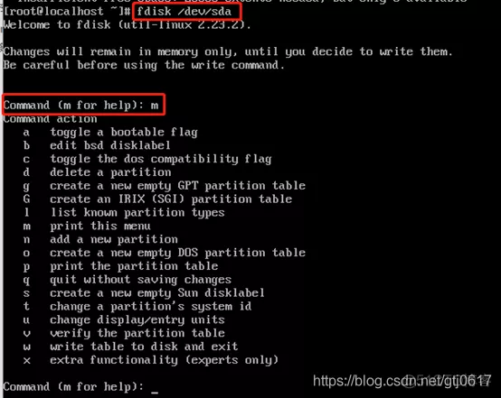

输入`n`选择增加新分区，输入`p`选择分区格式为主分区。然后直接按两次回车使用默认的起始扇区和结束扇区，这样能充分利用全部扇区。操作后提示100G分区已添加。输入`w`进行提交操作


 


使用`fdisk -l`查看多出来一个`/dev/sda3`的磁盘。

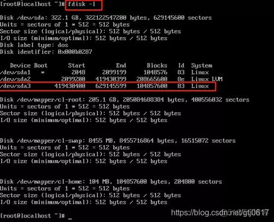

使用`partprobe`命令用于重读分区表,将磁盘分区表变化信息通知内核,请求操作系统重新加载分区表

使用命令`pvcreate /dev/sda3`创建物理卷


使用`vgscan`查询物理卷，可以查到本机物理卷名称为`cl`，然后使用`vgextend`扩展物理卷cl，键入命令`vgextend cl /dev/sda3`。


再使用`lvextend`扩展逻辑卷，命令：`lvextend -L +100G /dev/mapper/cl-root`。

接着用`df -h`查看，发现实际容量并没有变化，因为系统还不认识刚添加进来的磁盘文件系统，所以还需要使用`xfs_growfs`对文件系统进行扩容。命令：

```shell
xfs_growfs /dev/mapper/cl-root
```

或者使用`resize2fs –f`加上要扩展的分区名。

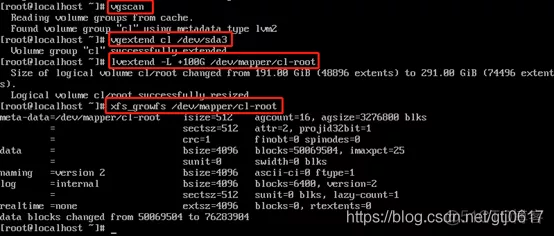


再使用`df -h`查看，分区扩展成功。

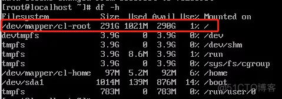


## 磁盘分区错误

新建虚拟机时，给虚拟机本身分配有200G磁盘空间。


在分区时，模拟错误分区，对系统的默认分区不作调整。此时/目录只有50G，而/home分区有141GB。

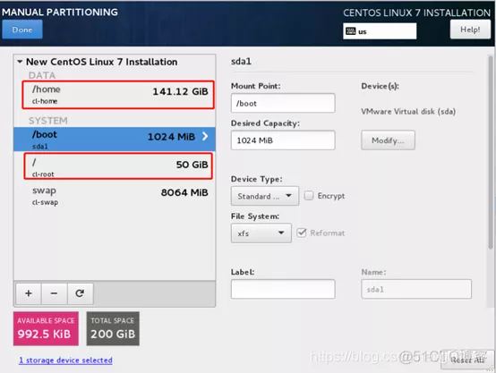

进入系统后，使用`df -h`命令查看分区和磁盘使用情况。此时`/home`目录的磁盘空间需要移除，全部分给`/root`目录（也就是cl-root）。

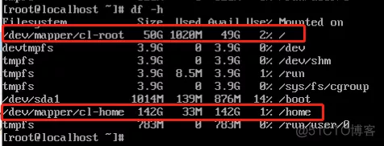

使用`fdisk -l`查看物理磁盘挂载情况。

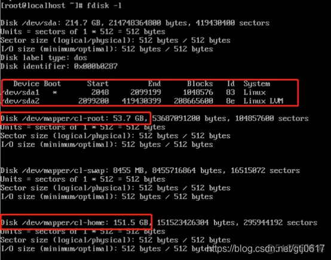

调整分区前正常是要备份数据的，可参考如下操作。但是新装系统没有什么数据的情况，可以不要数据，直接操作。


卸载/home。

如果`/home`存在进程，需要使用`fuser -m -v -I -k /home`终止`/home`下的进程，然后再使用`umount`卸载`/home`。


然后删除`/home`所在的lv。

```shell
lvremove /dev/mapper/cl-home
```

使用`lvextend`扩展逻辑卷`/root`，增加141G（如果增加空间超过可用大小，会报错）。

```shell
lvextend -L +141G /dev/mapper/cl-root
```

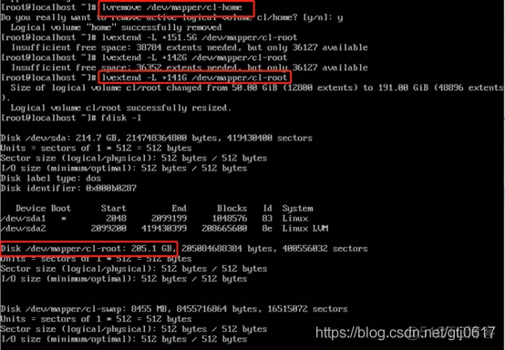

使用`xfs_growfs`对文件系统`/root`进行扩容。

```shell
xfs_growfs /dev/mapper/cl-root
```

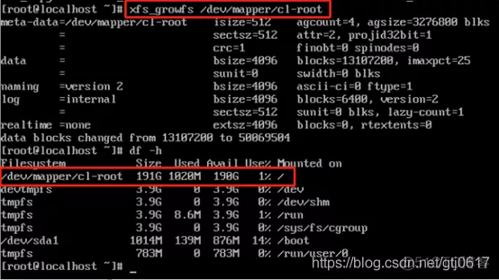

## 创建/home分区
如果某些特定场景，需要使用`/home`分区，而开始没有划分，则可以参照下文进行添加。

使用`vgdisplay`命令查看剩余分区大小，然后创建一个逻辑卷“home”。

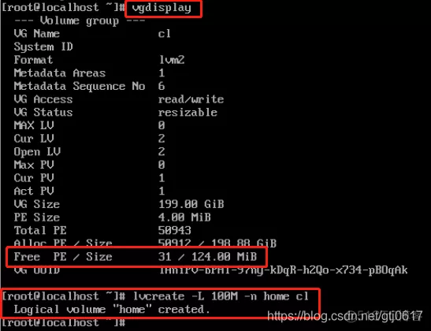

此时使用`fdisk -l`已经可以看到新的分区。

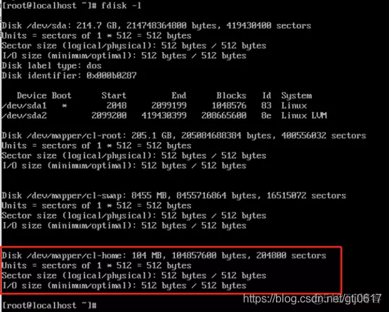

然后使用`mkfs.xfs`命令格式化分区，分区类型为`xfs`。


最后使用`mount`进行挂载，挂载位置为`/home`。再使用`df -h`进行查看，挂载成功。

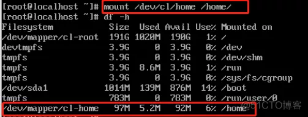

## 新增磁盘挂载扩容

实际使用中，也有可能当前存储用完了，需要新增其他分区，那么要使用添加硬盘，新增一块硬盘来处理。如下图，新增一块100G硬盘。


系统中使用`fdisk -l`查看，多了一块100G的sdb。


此时并不能直接使用，要使用`fdisk`进行分区。和前面类似，使用`fdisk /dev/sdb`对新硬盘进行分区。键入`n`创建分区，选择`p`分区类型为主分区，两次回车，最后`w`写入分区。

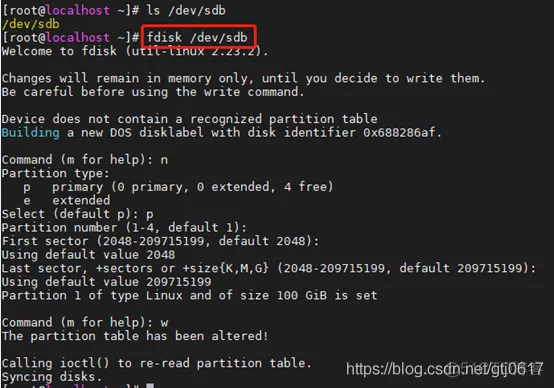

还是一样，使用`partprobe`通知系统分区表的变化，再使用`pvcreate`创建物理卷。使用`vgscan`查询物理卷，然后使用`vgextend`新增物理卷扩展`cl`。使用`lvextend`扩展逻辑卷，最后使用`xfs_growfs`对文件系统进行扩容。再使用`df -h`查看，分区扩展成功。

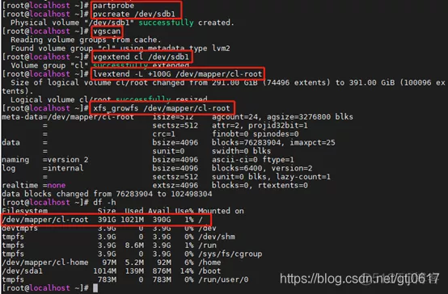

